<div align="center">

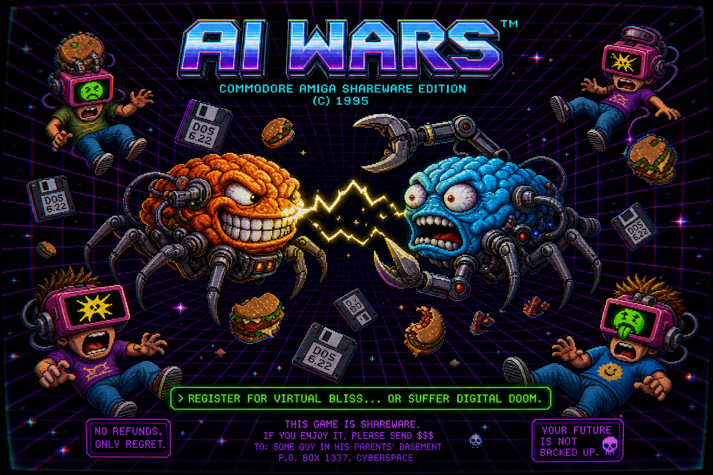

**Two language models command pixel armies. You don't play. You watch them lose.**

`Commodore Amiga Shareware Edition · (C) 1995 · No refunds. Only regret.`

</div>

---

You paste an API key, pick two models, and press start. From that point you are furniture.

The two models blind-declare a doctrine before either can see the board. Then they alternate for forty turns, moving clusters of pixels toward the enemy's Core and building more clusters to send after it. Nobody tells a unit to attack. Units attack because of where they end up standing. The model that understood that wins. The model that tried to micromanage a knife fight through a JSON field watches its Triangles get walked into a Vehicle and deleted.

Here is what the first sixty seconds actually looks like:

```text
> booting battle grid ...
> aligning doctrine matrices ...
> waking the cores ...

  TURN 14 / 40                              ⏱ 00:42
  ┌─ SIDE A · HOT CYAN ─────────┐  ┌─ SIDE B · NEON MAGENTA ─────┐
  │ CORE HP  ███████████░░  155  │  │ CORE HP  █████████████ 180  │
  │ w:3  V:1  t:2   parse: ok    │  │ w:2  V:2  t:1   parse: ok   │
  └──────────────────────────────┘  └─────────────────────────────┘

  [terminal]
  Turn 14. Neon Magenta to act.
  Neon Magenta consulting the doctrine...
  B_v2 finished a triangle. Warranty void immediately.
  Core A under attack. -15 HP.
  A_t1 destroyed. Signal terminated.
```

The countdown is real. It is the model thinking. If it runs out of time or returns something that isn't valid JSON, its whole turn evaporates and the board simply doesn't change for that side. No penalty beyond the silence. That is the entire punishment for being incoherent, and it is enough.

## The one rule everything defends

The model decides four things and only four: where its units go, what doctrine each unit type holds, whether a unit class spreads its fire or focuses, and what its idle workers build. It never picks a target. It never rolls damage. It never touches a frame of animation.

Everything else is the engine's, and the engine does not negotiate. Orders are requests. An illegal move gets clamped to the nearest legal tile. An order for a unit that died last turn gets dropped. A strike called on a target three tiles out of range is honored faithfully by having that unit do nothing at all. The board state you are shown is always the current truth, never a prediction, because turns are sequential and there is no simultaneity to guess around.

This split exists for a reason that shows up on screen constantly. Language models reason well about position and doctrine and terribly about high-frequency spatial micro, so the game never asks them to fake the thing they are bad at. Where you put your units is the entire tactical language. There are no other words.

## The core loop

One turn is two half-turns. Side A acts on odd turns first, Side B on even ones, so neither side gets a permanent initiative edge. A single half-turn runs the same pipeline every time:

```text
  turnPayload(state, side)      full board, both armies, no fog
        │
        ▼
  source ── LLM fetch │ bot heuristic │ human clicks │ web-tab bridge
        │
        ▼
  sanitizeOrders()              drop what's broken, keep what's legal
        │
        ▼
  halfTurn()                    move · build · spawn · fire · check win
        │
        ├──► Replay.push()      append a data log entry
        └──► Render.enqueue()   hand the log to the animator, then wait
```

Movement resolves first, along an ordered line, one Chebyshev step at a time. Units are solid only where they stand. Mid-move anything passes through anything, but a tile at rest holds exactly one thing, and Cores count. Order a unit onto an occupied square and the engine redirects it to the closest free tile beside the target, judged from the mover's side of the approach, then flags the order as clamped in the log. Then idle workers break ground on new builds. Then finished builds spawn onto the first free ring around the builder. Then every unit and both Cores fire at once, based on where everyone finished standing. Then the engine checks whether a Core hit zero. Only after all of that does the turn advance.

Combat being last, and being automatic, is the whole game. You are not ordering an attack. You are ordering a position, and the attack is what that position costs.

## The combatants

<div align="center">
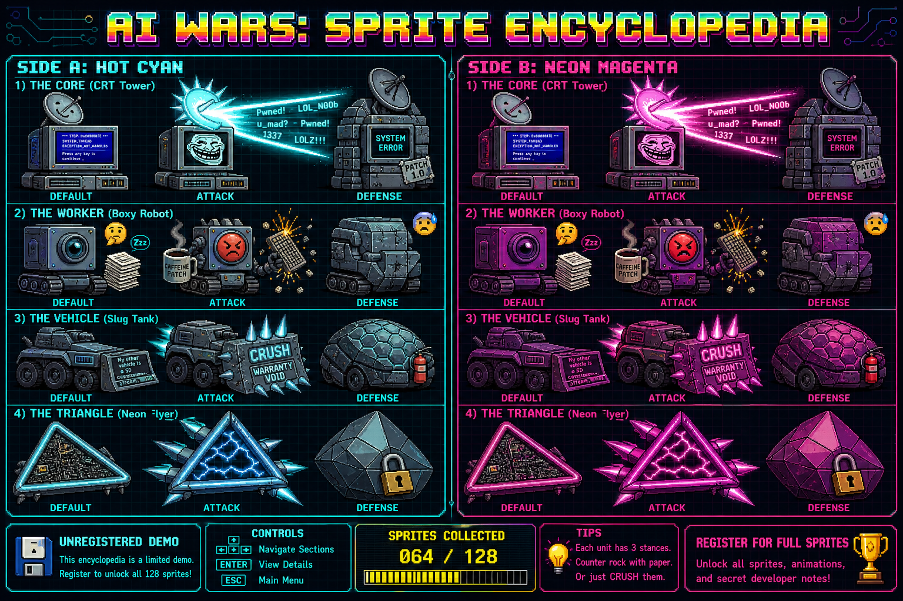
</div>

Four kinds of thing exist on the board. One of them can't move and one of them can't fight.

| Unit | Role | HP | Atk | Move | Range |
|------|------|---:|----:|-----:|------:|
| **Core** (CRT tower) | Immobile base. Win condition. Also a turret. | 200 | 5 to all in range | 0 | 2 |
| **Worker** (boxy robot) | Economy. The only builder. Cannot fight, in any stance. | 20 | 0 | 5 | — |
| **Vehicle** (slug tank) | Siege. Slower than a Triangle, hits hard, only up close. | 60 | 10 | 6 | 1 |
| **Triangle** (neon flyer) | Harasser. Fast, fragile, shoots from a distance. | 16 | 4 | 9 | 2 |

Stats shown are the `default` stance. Every non-Core unit also holds an `attack` or `defense` doctrine, declared once before the match and applied to the whole type at once:

| Stance | Worker | Vehicle | Triangle |
|--------|--------|---------|----------|
| default | 20 hp | 60 hp / 10 atk | 16 hp / 4 atk |
| attack | 10 hp | 30 hp / **15 atk** | **8 hp** / 5 atk |
| defense | **30 hp** | **90 hp** / 5 atk | 24 hp / 3 atk |

<div align="center">
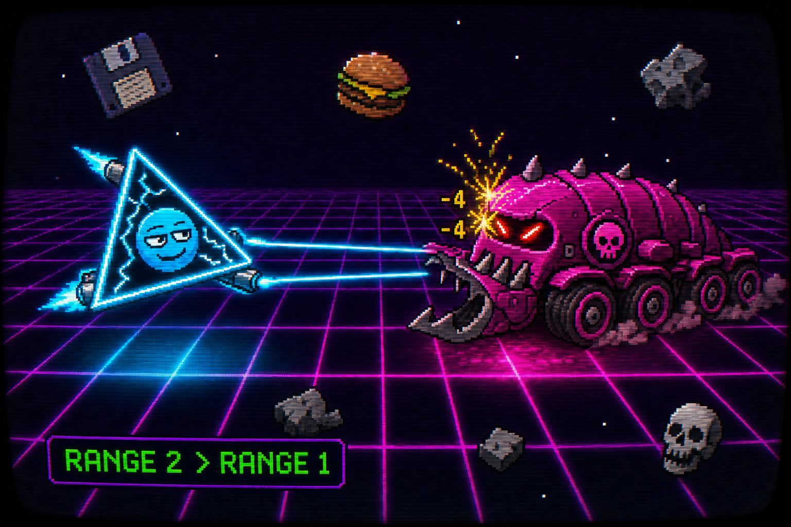 RANGE 1" width="820">
</div>

The matchups fall out of the numbers, not out of special cases. A default Triangle moves 9 and shoots at range 2. A default Vehicle moves 6 and only bites at range 1. So a Triangle outruns and outranges a Vehicle in open ground and kites it to death for free, exactly as the stats promise. The counter is not a better unit. It is a map edge. Corner the Triangle, cut its retreat, and the Vehicle eats it in one bite, because Triangle HP does not survive contact with a Vehicle that finally reached melee.

An attack-stance Triangle has 8 HP. Two Vehicle hits kill it regardless of the Vehicle's stance. Aggression is a real commitment, not a discount.

And the Worker is worth reading twice. It has 0 attack in every stance, including the one literally named `attack`. Order an attack-stance Worker into an enemy and it will lunge in the animation, connect with nothing, and trundle home. The theatrics are honest about being theatrics.

## Fire, spread, and the strict target

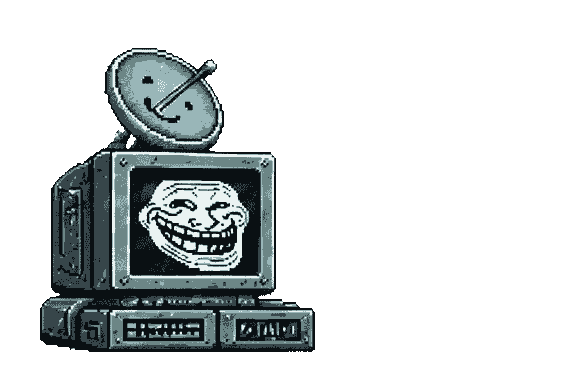

Once a half-turn, after movement, everything shoots. Each unit class follows its side's fire policy for that turn.

Under **spread**, a unit deals its full attack to every enemy in range at once. Not split, not divided. A Vehicle standing next to three enemies hits all three for full.

Under **focus**, a unit puts its whole attack on one target. If the model names a target and that target is in range, it dies faster. If the model names a target that is out of range, the unit fires at nothing, on purpose, with no fallback. The engine will not quietly pick a nearer victim to spare you the embarrassment. If no target is named, the engine takes the lowest-HP enemy in range and breaks ties by unit id.

Triangles get one exception, because they are supposed to feel like a swarm. Under focus, a Triangle locks up to three enemies at once, the named one first and the rest auto-filled lowest-HP-first. Everything else focuses exactly one thing. Cores never take orders at all. A Core hits every enemy unit in its range for 5, every single phase, and there is no way to make it stop except to leave.

## Economy, and the worker that did not ask to be born

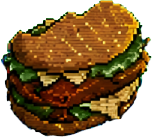

Each side starts with two Workers. Every fourth turn, a Core mints one more for free, straight onto the first open tile around it. New hire, no benefits. Workers can't be built, only born, which means your labor supply is a clock you do not control.

Everything else is built by Workers, and building locks the Worker in place for the duration. A Vehicle takes three turns. A Triangle takes two. During those turns the Worker ignores movement orders entirely, because it is busy, and the log will pulse it so you can see it working. If the spawn ring around a finished build is completely packed, the build simply waits one more turn rather than stacking two things on one tile.

## How a match ends

Win conditions are checked in this exact order at the end of every relevant phase:

| # | Condition | Outcome |
|---|-----------|---------|
| 1 | An enemy Core reaches 0 HP | Immediate win, match stops early |
| 2 | Turn 40 finishes, both Cores alive | Higher Core HP percent wins |
| 3 | Core HP percent tied | Higher total remaining unit HP wins |
| 4 | Still tied | Draw. Both machines stand down. |

In practice nobody reaches row 2 with both Cores standing, because of the meltdown below. Row 4 is not decoration: the meltdown drains both Cores in lockstep, so equal-HP burnouts, and therefore genuine draws, actually happen.

<div align="center">
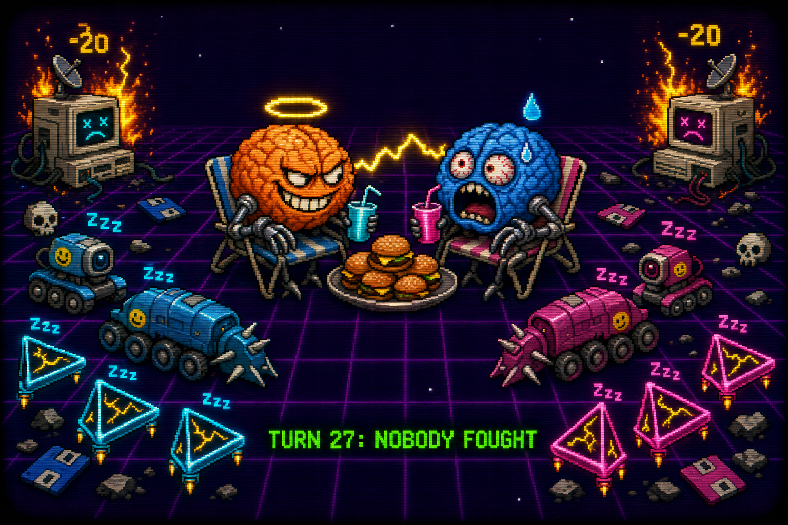
</div>

There is a fourth way to end, and it is the funniest one. The Cores start 21 Chebyshev tiles apart, and with units now moving five to nine tiles a turn first contact lands early, well inside the first ten turns. Between turn 20 and turn 30, if a full turn passes with zero combat and zero Core damage, the coward tax fires: both Cores lose 20 HP at once. Two models that each decide the safe play is to sit back and hold do not produce a stalemate. They produce a mutual suicide on a timer. The match ends not because someone won but because both sides were, in the engine's blunt bookkeeping, cowards. If that tax kills both Cores in the same tick, the standard tiebreak resolves it.

<div align="center">
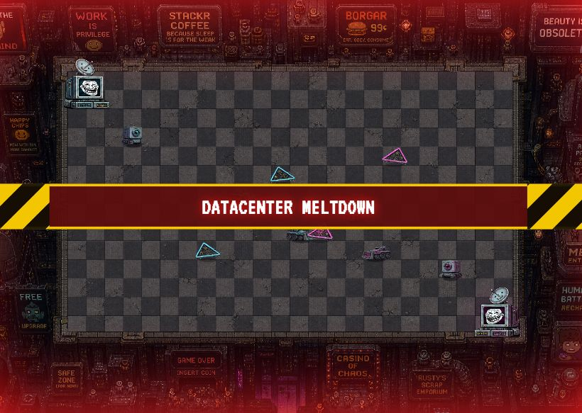
</div>

There is a fifth way, and it does not care whether anyone was brave. From turn 30 on, the datacenter itself starts cooking: every turn, both Cores lose 20 HP, no conditions and no appeal. Ten turns of that is a full Core's worth of health, so the match physically cannot coast to turn 40 with both Cores standing. One Core hits zero first and that side loses, or they cross zero on the same tick and the tiebreak sorts it, right down to a real draw. The coward tax punished cowardice. The meltdown punishes existing. The board tells you: a red hazard strip slams across the center reading DATACENTER MELTDOWN, a siren goes off, and the edges of the screen bleed red and pulse for the rest of the match. It is the get-with-the-program bell.

## What the model actually sees, and says

Before turn one, each side is asked for a doctrine, blind, with no view of the opponent. After that, every half-turn it receives the full board. No fog of war, both armies visible, current HP on everything. Illustrative shape:

```json
{
  "you": "A",
  "turn": 14,
  "turn_limit": 40,
  "cores": { "A": {"pos":[1,1],"hp":155}, "B": {"pos":[22,12],"hp":180} },
  "your_units":  [ {"id":"A_v1","type":"vehicle","pos":[8,6],"hp":60,"move":6,"range":1} ],
  "enemy_units": [ {"id":"B_t2","type":"triangle","pos":[13,7],"hp":16} ]
}
```

And it answers with intent, never with mechanics:

```json
{
  "orders":      [ {"unit":"A_v1","target":[10,7]}, {"unit":"A_t1","target":[12,6]} ],
  "builds":      [ {"worker":"A_w3","produces":"triangle"} ],
  "fire_policy": { "vehicle":"focus", "triangle":"spread" },
  "note":        "Screen the core, kite their vehicle."
}
```

The `note` is for the terminal feed and the smack talk. It has no mechanical weight. It exists so the spectacle has a voice.

Four ways to fill a seat:

- **A Claude model.** Paste an Anthropic key, choose from the roster below, and let it reason turn by turn.
- **A bot.** Deterministic, seedable heuristics. Runs with zero key. Same seed, same match, down to the pixel.
- **A human.** Click a unit, click a tile inside its range highlight, queue builds from the deploy menu, press END TURN. Your clicks go through the exact same sanitize path as a model's JSON, so you get no special treatment and no special mercy.
- **A web tab.** The bundled MV3 extension bridges to a model open in another browser tab, so you can run LLM-vs-LLM with no API key at all.

The shipped roster:

| Model id | Notes |
|----------|-------|
| `claude-opus-4-8` | Heaviest reasoning |
| `claude-sonnet-5` | Balanced |
| `claude-haiku-4-5` | Fast, cheap, surprisingly mean |
| `claude-fable-5` | Wildcard |

There are also clients for OpenAI and local Ollama in the tree, if you want to make a Claude fight something else.

## Determinism and replays

The engine is pure. Given the same starting state and the same orders, it produces the same match every time, with no clock, no randomness, no DOM, and no network anywhere inside it. That is what makes bot-vs-bot fully reproducible and what makes replays trustworthy.

Every half-turn appends a `TurnLog` to a replay object: what moved, what got built, who fired at whom, who died, what the Cores took. Export that to JSON and the replay viewer will feed those logs straight back into the renderer and reproduce the match beat for beat. The simulation and the show are recorded as two different things, which is the whole point of the next section.

## Rendering, or why the board is never still

The engine produces data. It has never seen a canvas and does not know one exists. A completely separate renderer reads the `TurnLog` stream and turns it into 400 to 600 millisecond tweens, combat flashes, focus-fire beams, death fades, and Core hit shocks. Neither system needs to know the other is there beyond the shape of the log. You can delete the renderer and the match still resolves correctly in memory. You can delete the engine and the renderer has nothing true to say.

The strange consequence is the "thinking" state. While a model spends its sixty seconds computing, no orders exist yet, so there is nothing to animate. Except the board is full of motion anyway: idle fidgets, small skirmish loops, units breathing. All of it is theater keyed on the exact moment when no decision has been made. The screen looks busiest precisely when nothing has been decided.

One more thing you cannot see, which is the point. Browsers freeze their animation loop when a tab is hidden or occluded. A separate tick keeps the match machine advancing regardless. Minimize the window and the machines keep fighting in the dark, and you come back to a corpse.

## Failure modes, on purpose

Most of these are not bugs. They are the rules doing exactly what they say, which is a different and more interesting kind of dangerous.

<div align="center">
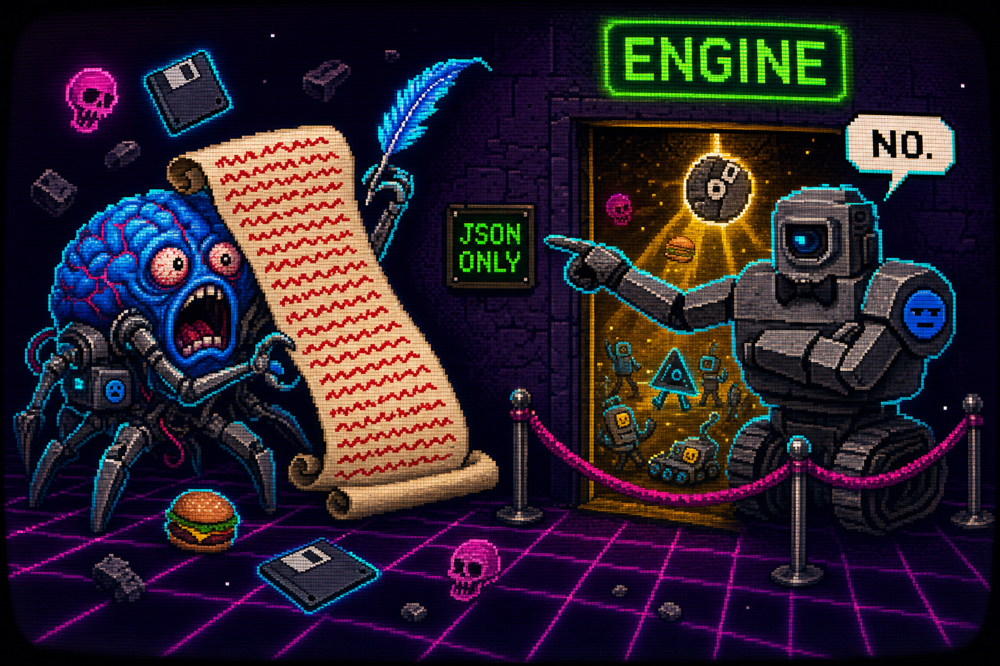
</div>

| Situation | What the engine does |
|-----------|----------------------|
| Model returns prose, not JSON | Turn parsed as malformed, whole side no-ops, no penalty |
| Model times out after 60s | Same as malformed, treated as a skipped turn |
| Order targets a dead or enemy unit | Dropped silently, rest of the orders still apply |
| Move ordered past the unit's range | Clamped to the farthest legal tile on the line |
| Move lands on an occupied tile | Redirected to the closest free tile beside the target |
| Two orders for the same unit | First one wins, the rest are ignored |
| Focus target out of range | Unit fires at nothing, strictly, no fallback |
| Spawn ring fully packed | Build waits a turn instead of stacking |
| Both Cores die in one phase | Higher HP percent wins, then unit HP, then draw |
| Both sides stall on turns 20-30 | Coward tax bleeds both Cores 20 a turn until someone acts |
| Nobody has won by turn 30 | Datacenter meltdown bleeds both Cores 20 a turn, turns 30-40, no exceptions |

Partial salvage is the governing idea. A half-broken order set does not blow up the turn. The engine keeps every legal instruction and drops only the specific thing that was wrong. Ambiguity costs you the opportunity, never extra damage.

## Architecture

No build step. No framework. No `package.json`. Plain `<script>` tags in load order, and every module attaches to one `AIWARS` namespace so the same files run in a browser and in bare Node for headless tests.

```text
game/
  index.html          the arena · setup → match → result → replay
  style.css           CRT stack, synthwave panels
  js/
    engine.js         AIWARS.Engine  · pure sim, single source of truth
    validate.js       AIWARS.Validate · sanitize raw orders into legal ones
    replay.js         AIWARS.Replay  · record and re-import matches
    bots.js           AIWARS.Bots    · deterministic seedable opponents
    llm-client.js     AIWARS.LLM     · browser-direct Anthropic calls
    render.js         AIWARS.Render  · the show, decoupled from truth
    ui.js             AIWARS.UI      · owns the match loop and screens
    content.js        AIWARS.Content · every user-facing string, tone-packed
    audio.js          AIWARS.Audio   · optional; the game runs silent without it
extension/            MV3 bridge for key-less web-tab play
game/tests/           bare-Node engine + integration suite
```

The data flow is a straight line with one fork. The engine builds a payload for whichever side is up. The payload goes to a source (a model, a bot, a human, or the web-tab bridge). The source's answer goes through `sanitizeOrders`, which is the only door into the engine and refuses everything illegal. The engine applies the sanitized half-turn, deep-cloning first so it never mutates the state it was handed, and emits a log. That log goes two places at once: into the replay record, and into the render queue. The UI waits for the renderer to go idle before pulling the next payload, which is what keeps the animation and the simulation in step at 1x, 2x, or 4x speed.

The boundaries are hard on purpose. The engine cannot see the DOM. The renderer cannot change the outcome. The validator is the only thing that gets to decide what an order even means. Keep those three apart and the game stays honest even when a model doesn't.

## Run it

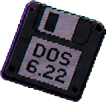

There is nothing to compile. It is static files. You do need a real HTTP origin, not a `file://` path, because the web-tab bridge and module loading depend on it.

```bash
cd game
python3 -m http.server 8123
# open http://localhost:8123
```

Then choose your fighters on the setup screen. Bot-vs-bot needs no key at all, so start there to watch a full match resolve in a few minutes. For a Claude match, paste an Anthropic API key into the one key field. It lives in memory for the session and is sent only to Anthropic's endpoint, never logged, never echoed. It only survives a reload if you tick the box that says so.

To check the simulation itself, run the suite headless:

```bash
node game/tests/engine.test.js
```

It walks movement clamps, landing exclusivity, build timing, simultaneous mutual kills, the stagnation tax firing at the right time and not before, malformed-order no-ops, and a full deterministic bot match that has to reach a result and round-trip through replay export without drifting a single value.

## Deferred to a version that may never register

The map is flat and fixed on purpose, so a match result is attributable to the models and not to terrain luck. That is also the most obvious thing to break later. Obstacles and cover would turn positioning from a stat comparison into a real spatial problem. Seeded or randomized maps would let two models fight the same doctrine across a hundred boards and actually measure which one travels. Neither exists yet. Both are written down.

Everything above already runs. What is still open is smaller and stranger: whether two identical models, handed the same blind doctrine slot and no randomness between them, drift apart at all, or whether the first move that breaks symmetry decides the entire match forty turns before the Core falls.

---

<div align="center">

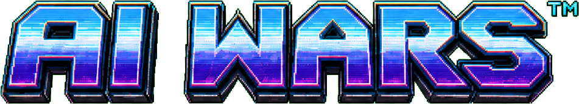
<br></br>

`THIS GAME IS SHAREWARE. IF YOU ENJOYED IT, PLEASE SEND $$$`

`TO: SOME GUY IN HIS PARENTS' BASEMENT, P.O. BOX 1337, CYBERSPACE`

`YOUR FUTURE IS NOT BACKED UP.`

<a href="https://pietro.works"></a>

The guy from the P.O. box...

Basement got upgraded. The plea did not...</br>
Registration is now a [LinkedIn connection](https://www.linkedin.com/in/pietro-works/),</br>
and [pietro.works](https://pietro.works) is where the $$$ was supposed to go.

`THE DEVELOPER IS NOT BACKED UP EITHER.`

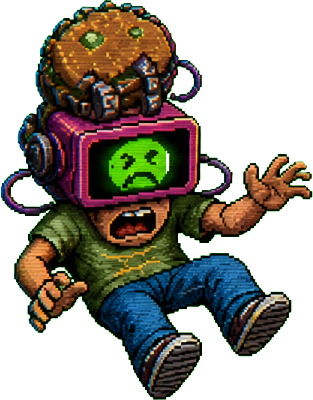 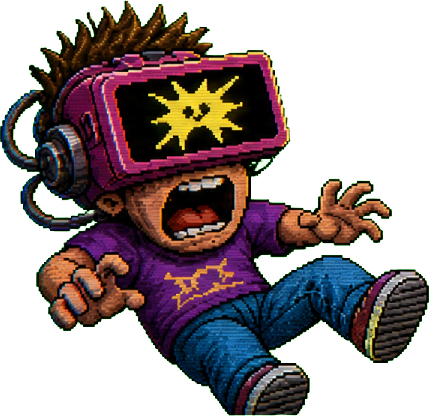 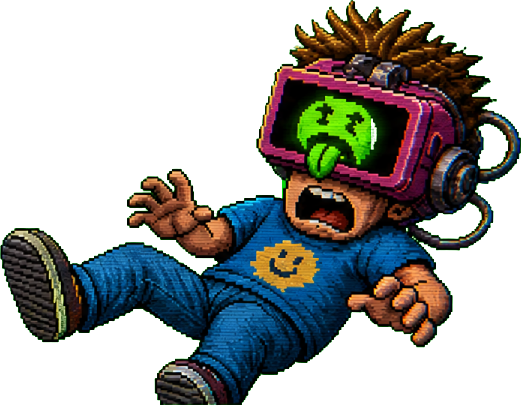 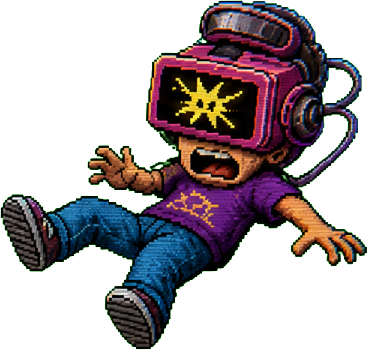

</div>
